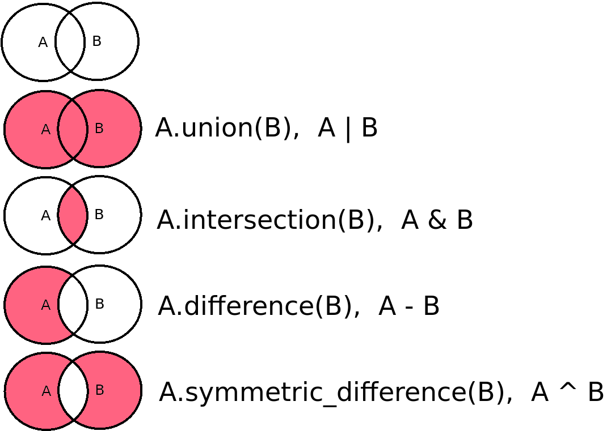

# Kunstroof
Er heeft een kunstroof plaatsgevonden in het nationale kunstmuseum van
Waddinxveen. De politie ziet een deel van de inwoners van Nederland
als mogelijke dader. In bestand [inwoners.csv](inwoners.csv) vind je
de id en naam van elke van deze 200.000 mogelijke daders.

Het is jouw taak om voor de politie de groep van mogelijke daders zo
klein mogelijk te maken op basis van onderstaande informatie.

## Buitenland
Mensen die in het buitenland waren ten tijden van de kunstroof zijn
geen daders. De id van deze mensen vind je in bestand
[buitenland.csv](buitenland.csv).

**opdracht1**: Bepaal de ids van de nog mogelijke daders. Gebruik
hierbij eerst een `list` om de ids op te slaan en op te zoeken.

*tip:* Gebruik Python module 'csv' om makkelijker csv bestanden te lezen.

*test:* Er zouden nog 183.745 mogelijke daders moeten overblijven.

**opdracht2**: Het zoeken in een `list` is traag, gebruik daarom nu
een `set` om de ids op te slaan en op te zoeken voor hogere snelheid.

*tip:* Controleer of het type van de verzamelingen van ids echt `sets`
zijn door het type te printen, bv met: `print( type(dader_ids) )`.

- Hoeveel sneller is een `set` in dit geval?
- Is het resultaat hetzelfde als bij gebruik van een `list`?
- Waarom is een `set` sneller?

**opdracht3**: Het is nog iets sneller, makkelijker en leesbaarder om
[set operatoren](https://docs.python.org/3/tutorial/datastructures.html#sets)
te gebruiken. Gebruik deze operatoren in je programma.

## Lengte
Met beveiligingscamera's is vastgesteld dat de dader een lengte heeft
groter of gelijk aan 150 en kleiner of gelijk aan 160 cm. De lengte van
inwoners vind je in bestand [lengte.csv](lengte.csv).

**opdracht4**: Wat zijn nu de ids van de nog mogelijke daders?

*test:* Er zouden nog 49.130 mogelijke daders moeten overblijven.

## Geboortedatum
Op basis van getuigenverklaringen is vastgesteld dat de dader geboren
is in of na 1980 en in of voor 1990. De geboortedatum van inwoners vind
je in bestand [geboortedatum.csv](geboortedatum.csv).

**opdracht5**: Wat zijn nu de ids van de nog mogelijke daders?

*tip:* Probeer waar mogelijk code-duplicatie te voorkomen door
herbruikbare functies te maken.

*test:* Er zouden nog 9.643 mogelijke daders moeten overblijven.

## Beroepscrimineel of Gelegenheidsdief
De politie neemt aan dat de dader een beroepscrimineel is die al
eerder in contact is gekomen met justitie, **of** dat het een
gelegenheidsdief is die binnen 50km van het museum woont. Het museum
bevindt zich op GPS coordinaat breedtegraad:52.030592,
lengtegraad:4.641464.

De ids van beroepscriminelen die al eerder in contact zijn gekomen met
justitie vind je in bestand
[beroepscrimineel.csv](beroepscrimineel.csv).

De postcode van inwoners vind je in bestand
[postcode.csv](postcode.csv).

Het GPS coordinaat van iedere postcode vind je in bestand
[postcode_coordinaat.csv](postcode_coordinaat.csv).

### GPS coordinaten
Gebruik Python module 'geopy' om afstanden tussen GPS coordinaten te
bepalen. Installeer deze module met:

~~~
pip install geopy
~~~

Vervolgens kun je op deze manier bijvoorbeeld de afstand tussen
Amsterdam en Parijs bepalen:

~~~ python
from geopy.distance import distance as geopy_distance

amsterdam = (52.372947, 4.893291)
parijs    = (48.857891, 2.295166)

print(geopy_distance(amsterdam, parijs).km)  # distance in kilometers
~~~

**opdracht6**: Wat zijn nu de ids van de nog mogelijke daders?

*tip:* Gebruik eventueel een `dict` om snel informatie van
een postcode te kunnen opzoeken maar, er zijn verschillende manieren
om de ids te bepalen, sommige sneller dan andere.

*test:* Er zouden nog 2.700 mogelijke daders moeten overblijven.

# Resultaat
Raporteer je resultaat.

**opdracht7**: Maak een csv bestand 'daders.csv' van de nog mogelijke
daders met 'id, naam' als header.
