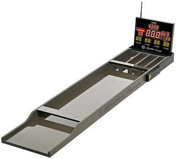

# Sjoelen

  
<small>[Wikipedia CC BY](https://commons.wikimedia.org/wiki/Category:Table_shuffleboard#/media/File:슐런보드_경기용.jpg)</small>

`Sjoelen` is an old Dutch board game that can be played by yourself or against friends. Every player plays three rounds, in which they try to slide 30 discs through 4 different gates at the end of the board. After each round, the discs that haven't entered one of the gates are gathered to be used in the next round. Invariably, at the end of the third round some of the 30 discs will still not have entered one of the gates.

The four gates each provide a different number of points: 2, 3, 4, and 1. When a disc is slid through each of the gates, an total of 20 points is awarded. All remaining discs that do not are not part of such a 'quartet' count for the number of points of the gate they slid through. 
When for example `[3, 4, 3, 5]` discs are present behind the 4 different gates, then there are three quartets that amount to `3 * 20 = 60` points. Then there are `[0, 1, 0, 2]` discs remaining behind the gates, they award `0 * 1 + 1 * 3 + 0 * 4 + 2 * 1 = 5` points. Together that makes for `60 + 5 = 65` points.

To simulate a game of `sjoelen` we assume each disc has a chance of 25% to be slid through one of the 4 gates (and 75% chance of it missing altogether).
When a disc slides through a gate it has a chance of 30% to go through the gate with 1 point, 30% chance with 2 points, 20% with 3 points, and 20% with 4 points.

## Assignment

Implement, in a file called `sjoelen.py`, a program that simulates three rounds of a game of `sjoelen`. Keep count of the number of discs that pass through the various gates and calculate the score when the game is finished.

## Code

Design your program as described below. Complete the docstrings with doctests and any other explanation you deem necessary.

    def calculate_points(board: list) -> int:
        """
        Calculate the amount of points that is scored. The sequence of points is [2, 3, 4, 1] for the different gates. Each quartet of discs counts for 20 points and those discs no longer count for other points.
        """

    def shuffle_round(board: list, discs: int) -> int:
        """
        Simulate a single round of 'sjoelen'. Return the number of stones that can still be slid.
        """

    if __name__ == '__main__':
        <Setup the board and the number of discs, simulate three rounds and calculate the score>

## Tips

* This game is based on chances. There's different ways of simulating those. One of which is to generate a random number between 0 and 1. When comparing this generated number with a particular chosen number we can simulate a chance. For our program we have to simulate a chance of 25% that a gate passes any gate, so a random number `x` between 0 and one (generated through `random.uniform(0,1)`) can be compared with 0.25. If `x <= 0.25` then the disc successfully passes a gate, but for values of `x > 0.25` it does not.

* When determining which gate a disc passes we have 4 different values that sum to 1 (0.3 + 0.2 + 0.2 + 0.3 = 1). Let's say a disc passes the gate with 2 points if `x <= 0.3`, than a disc will pass the gate with 3 points if `0.3 < x <= 0.5`.

* To use `random.uniform()` you need to add `import random` right at the top of your program.

* Take note: you will want to print the list with the discs that passed the various gates at the end of your program. That means you should not change the list when your tallying up the points.

## Examples

Your program should work like the examples below.

    $ python sjoelen.py
    These are your results: [4, 3, 3, 5]
    That's 64 points!

    $ python sjoelen.py
    These are your results: [2, 4, 6, 2]
    That's 62 points!

    $ python sjoelen.py
    These are your results: [6, 2, 3, 7]
    That's 57 points!
