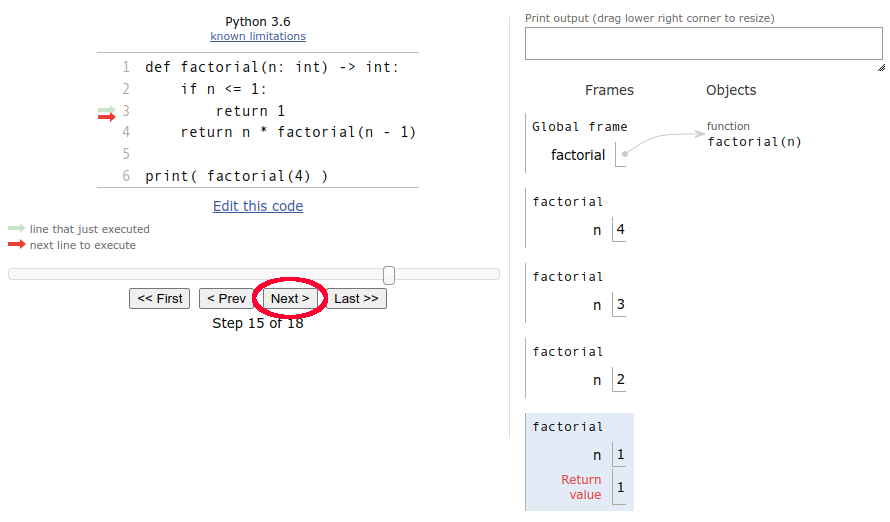
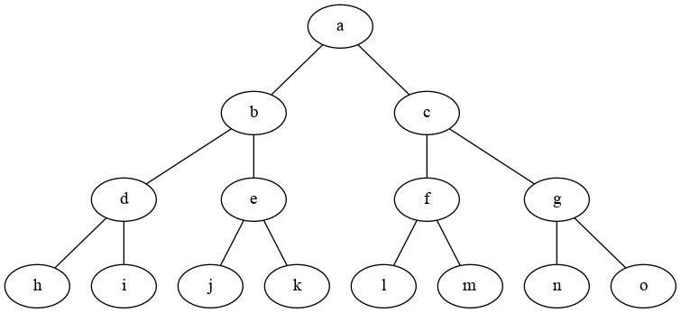

# Iteratie en Recursie

Sommige problemen kunnen met iteratie en met recursie worden
opgelost. Bij recursie laat je een functie zichzelf aanroepen, iets
wat je al veel in de Prolog programmeertaal hebt gedaan. Het is soms
ook nuttig om recursie in Python te gebruiken.

## Factorial
Bijvoorbeeld bij het berekenen van een factorial. De factorial van '4'
(het aantal volgorden waarop we 4 verschillende dingen kunnen zetten)
is bijvoorbeeld:

```
factorial(4) = 4 * 3 * 2 * 1 = 24
```

Dit kunnen we makkelijk berekenen met gebruik van de 'math' module:

```
import math

print( math.factorial(4) ) # 24
```

maar als we zelf de functie zouden willen schrijven kunnen we dat
**iteratief**, met gebruik van `for`/`while` loops, doen met:

```
def factorial(n: int) -> int:
    result = 1
    for i in range(n, 0, -1):
        result *= i
    return result

print( factorial(4) ) # 24
```

of **recursief**, met een functie die zichzelf (direct of indirect)
aanroept, doen met:

```
def factorial(n: int) -> int:
    if n <= 1: # base case 
        return 1
    return n * factorial(n - 1) # recursive case

print( factorial(4) ) # 24
```

Het resultaat met iteratie en recursie is hetzelfde. Om bij recursie
te voorkomen dat de functie zichzelf oneindig blijft aanroepen hebben
we een 'base case' nodig, een conditie waarbij het zichzelf aanroepen
ophoudt. De 'base case' is dit geval `n <= 1`, als deze conditie
`True` is returnen we '1'.

Als deze 'base case' conditie `False` is komen we bij de 'recursieve
case'. Hier wordt het probleem doorgaans opgesplits in kleinere
deelproblemen. In het geval van `factorial(n)` splitsen we het
probleem op in `n` vermenigvuldigd met `factorial(n - 1)`.

Als we `factorial(4)` met de hand uitschrijven ziet dat er dus zo
uit:

```
factorial(4) = 4 * factorial(3)
factorial(4) = 4 * 3 * factorial(2)
factorial(4) = 4 * 3 * 2 * factorial(1)
factorial(4) = 4 * 3 * 2 * 1
factorial(4) = 4 * 3 * 2
factorial(4) = 4 * 6
factorial(4) = 24
```

## Stack

Elke aanroep van een functie heeft zijn eigen waarden voor de
verschillende variabelen van de functie. Om de verschillende waarden
voor variabelen per functie-aanroep op te slaan, wordt de *stack*
(Nederlands: 'stapel') gebruikt om deze waarden op te
stapelen. We kunnen Python Tutor gebruiken om de stack te
visualiseren:




**opdracht1:** Voer zelf het [recursieve factorial programma in Python
Tutor](https://pythontutor.com/render.html#code=def%20factorial%28n%3A%20int%29%20-%3E%20int%3A%0A%20%20%20%20if%20n%20%3C%3D%201%3A%0A%20%20%20%20%20%20%20%20return%201%0A%20%20%20%20return%20n%20*%20factorial%28n%20-%201%29%0A%0Aprint%28%20factorial%284%29%20%29&cumulative=false&curInstr=1&heapPrimitives=nevernest&mode=display&origin=opt-frontend.js&py=3&rawInputLstJSON=%5B%5D&textReferences=false)
uit door herhaaldelijk op 'next' te klikken om te zien hoe de stack
groeit en weer afneemt tijdens de uitvoer.

Dus al is er maar één variabele 'n' te lezen in het programma, er staan
op het hoogtepunt wel 4 verschillende waarden van 'n' op de stack
omdat de functie 4 keer wordt aangeroepen.

## Debug Prints

Het kan best lastig zijn om door het toevoegen van debug print
statements aan een recursieve functie duidelijk weer
te geven hoe de functie werkt. Dit is mijn poging:

```
def factorial(n: int) -> int:
    print(f'factorial({n})')
    if n <= 1:
        print(f'factorial({n}) return 1 (base case)')
        return 1
    result = factorial(n - 1)
    print(f'{n} * {result}')
    new_result = n * result
    print(f'factorial({n}) return {new_result}')
    return new_result

print( factorial(4) )
```

wat deze uitvoer oplevert:

```
factorial(4)
factorial(3)
factorial(2)
factorial(1)
factorial(1) return 1 (base case)
2 * 1
factorial(2) return 2
3 * 2
factorial(3) return 6
4 * 6
factorial(4) return 24
24
```

**opdracht2:** Herschrijf zelf de originele `factorial()` functie en
voeg debug print statements toe om voor jezelf zo duidelijk mogelijk
weer te geven hoe deze functie werkt.


## Has Member

De functie `has_member(value: int, collection: list[int]) -> bool` zou
`True` of `False` moeten returnen afhankelijk van of `value` voorkomt
in de `collection` of niet. We kunnen de functie gemakkelijk op een
iteratieve manier schijven als:

```
def has_member(value: int, collection: list[int]) -> bool:
    for v in collection:
        if value == v:
            return True
    return False

print( has_member(3, [1,2,3,4]) ) # True
print( has_member(5, [1,2,3,4]) ) # False
```

**opdracht3:** Schrijf de `has_member()` functie op een recursieve
manier, dus zonder gebruik van loops maar met een functie die zichzelf
aanroept.

*tip:* Splits het probleem op in kleinere deelproblemen door te testen of
 `value` vooraan in de collection staat (`collection[0]`), of dat het
 in het overige deel van de collection staat (`collection[1:]`).

## Permutaties

Een recursieve manier lijkt vaak ingewikkelder dan een iteratieve
manier, maar in sommige gevallen is de recursieve manier de
makkelijkste manier om een probleem op te lossen. Bijvoorbeeld, stel
we willen alle mogelijke permutaties van letters 'a', 'b', en 'c'
vinden met een bepaalde lengte. We kunnen dit recursief schrijven als:

```
def permutations(length: int, values: list[str], result: str) -> None:
    if len(result) >= length: # base case
        print(result)
    else:
        for v in values:
            permutations(length, values, result + v)

permutations(3, ['a', 'b', 'c'], '')
```

waarbij we in een loop de functie recursief aanroepen met steeds één
van de values toegevoegd aan `result`. Het resultaat is dat alle
permutaties worden aangemaakt in de onderstaande volgorder van 1 t/m
39:


Dit programma is recursief veel makkelijker te schrijven dan
iteratief.

**opdracht4:** Pas het programma aan zodat het alle permutaties met
lengte 4 print van letters 'a', 'b', en 'c' zonder permutaties waar
een letter zichzelf opvolgt. Dus bijvoorbeeld geen 'aabc' want hier
volgt een 'a' een andere 'a' op, maar wel 'abac'.

*test:* Er zouden 24 permutaties geprint moeten worden.

## Routebepaling

In onderstaande graaf (Engels: graph) is elke knoop (Engels: node)
weergegeven als een elipse met een letter. Je kunt van een knoop naar
een andere knoop reizen als er een boog (Engels: edge) bestaat tussen
deze twee knopen. Een boog is weergegeven als een lijn.



Alle bogen van deze graaf staan in deze Python list:
```
edges = ['ab', 'ac', 'bd', 'be', 'cf', 'cg', 'dh', 'di', 'ej', 'ek', 'fl', 'fm', 'gn', 'go']
```

De graaf is bidirectioneel wat betekent dat bijvoorbeeld boog 'ab'
zorgt dat je van 'a' naar 'b' kunt reizen, maar ook andersom van 'b'
naar 'a'.

**opdracht5:** Schrijf een programma wat de route print van 'a' naar
'k'. Zorg dat je programma ook werkt voor een route tussen andere
knopen.

*tip:* Je kunt een `dict` gebruiken om voor iedere knoop bij te
houden naar welke andere knopen je kunt reizen.

*test:* Het is duidelijk in de graaf te zien dat de route van 'a' naar
'k' de route 'abek' moet zijn.

Deze grotere graaf:


heeft deze bogen:
```
edges = ['yk', 'pe', 'tm', 'td', 'bd', 'hu', 'vb', 'br', 'od', 'ae', 'ha', 'yh', 'bg', 'wr', 'ux', 'qv', 'bh', 'rl', 'ts', 'aw', 'yv', 'uf', 'ry', 'vr', 'ln', 'nz', 'ke', 'cz', 'vx', 'uo', 'ad', 'px']
```

**opdracht6:** Schrijf een programma wat alle routes print van 'a'
naar 'k' in deze grotere graaf waarbij een route niet meer dan één
keer over dezelfde letter mag gaan.

*test:* Er zouden 113 routes moeten worden geprint. Eén daarvan is
route 'awrvyk'.

## Mutable

We hebben een string gebruikt om in het programma een route te
representeren zoals in de string 'awrvyk' maar, we kunnen ook een
`list` gebruiken zoals in `['a', 'w', 'r', 'v', 'y', 'k']`. Een
belangrijk verschil is dat een string immutable is terwijl een `list`
mutable is.

**opdracht7:** Pas het programma aan zodat een `list` i.p.v. een
string gebruikt wordt voor de representatie van een route.

*test:* Dezelfde 113 routes zouden moeten worden geprint.
