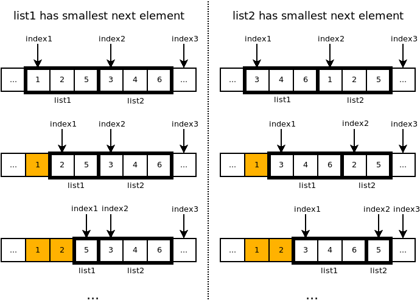

# Algorithms

Get more comfortable with sorting algorithms. Each algorithm below intends to sort a list of integers called 'array' into ascending order. Generally speaking, smaller elements in the list are moved to the "left" and larger elements are moved to the "right", until they are in order.

> Do the exercises on paper!

## Swapping

In most of the sorting algorithms below, *swapping* is important. By swapping, we mean exchanging the values at two positions in the list.

## Selection sort


The following Python code describes the selection sort algorithm.

~~~ python
n = len(array)
for i in range(n):
    min_j = i; j = i
    for j in range(i, n):
        if array[j] < array[min_j]:
            min_j = j
    array[min_j], array[i] = array[i], array[min_j]  # swapping
    print(array) # debug print
~~~

Perform this code on paper with list 'array' with values `[5, 1, 2, 8, 6]`. Show every swap on an individual line and show which elements you're swapping by underlining them. Also show which part of the array is sorted on every line by drawing a rectangle around the sorted part of the array.  


## Bubble sort


Consider the following Python code for bubble sort.

~~~ python
n = len(array)
counter = 1
while counter > 0:
    counter = 0
    for i in range(n - 1):
        if array[i] > array[i + 1]:
            array[i], array[i + 1] = array[i + 1], array[i]  # swapping
            counter += 1
    print(array) # debug print
~~~

Perform this code on paper with list 'array' with values `[5, 1, 2, 8, 6]`. Show every swap on an individual line and show which elements you're swapping by underlining them. Also show which part of the array is sorted on every line by drawing a rectangle around the sorted part of the array.  


## Insertion sort


Consider the following Python code for insertion sort.

~~~ python
n = len(array)
for i in range(n):
    element = array[i]
    j = i
    while j > 0 and array[j - 1] > element: # swapping
        array[j] = array[j - 1]
        j = j - 1
    array[j] = element
    print(array) # debug print
~~~

Perform this code on paper with list 'array' with values `[5, 1, 2, 8, 6]`. Show every swap on an individual line and show which elements you're swapping by underlining them. Also show which part of the array is sorted on every line by drawing a rectangle around the sorted part of the array.  


## Merge sort


Consider the following Python code for merge sort where we merge a list in place.

~~~ python
def merge_in_place(array: list[Any], index1: int, index2: int, index3: int) -> None:
    """ Merge in place two sorted adjacent lists in 'array' to one sorted list. 
    List1 starts at 'index1' and goes up to 'index2'. 
    List2 starts at 'index2' and goes up to 'index3'. """
    size1 = index2 - index1 # the size of list1
    size2 = index3 - index2 # the size of list2
    while size1 > 0 and size2 > 0:
        # check which list has next smallest element
        if array[index1] <= array[index2]:
            # if list1 has smallest it is easy
            index1 += 1
            size1 -= 1
        else:
            # if list2 has smallest we have to also move list1
            smallest = array[index2]
            index2 += 1
            size2 -= 1
            oldindex1 = index1
            index1 += 1
            array[index1:index1+size1] = array[oldindex1:oldindex1+size1] # moves list1
            array[oldindex1] = smallest # insert smallest

n = len(array)
sub_list_length = 1 # start with sub_list_length of 1
while sub_list_length < n:
    # loop over all pairs of sub_lists as [index1:index2] and [index2:index3] 
    for index1 in range(0, n, sub_list_length * 2):
        index2 = index1 + sub_list_length
        index3 = min(len(array), index2 + sub_list_length) # make sure index3 is valid
        # merge the pair of sub_lists
        merge_in_place(array, index1, index2, index3) # swapping
        print(array) # debug print
    sub_list_length *= 2 # double the sub_list_length
~~~

Perform this code on paper with list 'array' with values `[5, 1, 2, 8, 6]`. Show every swap on an individual line and show which elements you're swapping by underlining them. Also show which part of the array is sorted on every line by drawing a rectangle around the sorted part of the array.  


### Merge in place

The ```merge_in_place()``` function is different from the
```merge()``` function in the book (Practical Programming, Third
Edition An Introduction to Computer Science Using Python) that creates
many differen lists. The ```merge_in_place()``` function merges in
place (so without using other lists to store data) the adjacent list1
and list2 in a larger list as shown in the figure below. It does this by
repeatedly moving the next smallest element to the sorted part of the
list (in orange). If it came from list1 it just makes list1 one
element shorter. If it came form list2 it makes list2 one element
shorter, but then it also moves the whole list1 one position to the
right. The function can stop when list1 or list2 has zero length.


