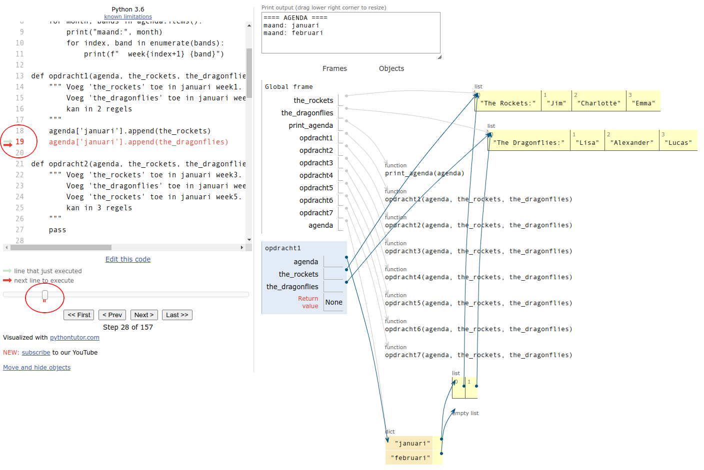

# Feestagenda

In deze opdracht oefenen we met het Python memory model, we gaan een
feestagenda invullen.

In de main van onderstaande programma [feestagenda.py](feestagenda.py)
wordt een lege feestagenda gemaakt die we gaan vullen met bands. In de
functies `opdracht1()` t/m `opdracht7()` gaan we steeds de agenda iets
aanpassen. Lees de docstring documentatie van ieder opdracht-functie
om te zien wat er moet gebeuren. Als je het programma runt zie je dat
functie `opdracht1()` nu al correct werkt. Bij elke opdracht-functie
is ook aangegeven in hoeveel regels deze kan worden
geïmplementeerd. Met een slimme aanpak zijn er maar weinig regels
nodig. Probeer de opdracht-functies zo kort mogelijk te houden.

~~~python
def main():
    agenda = {'januari': [], 'februari': []} # lege agenda met 'januari' en 'februari'
    print_agenda(agenda)

    # de bands:
    the_rockets     = ['The Rockets:', 'Jim', 'Charlotte', 'Emma']
    the_dragonflies = ['The Dragonflies:', 'Lisa', 'Alexander', 'Lucas']

    # we vullen de agenda in
    print("\nopdracht1:")
    opdracht1(agenda, the_rockets, the_dragonflies)
    print_agenda(agenda)

    print("\nopdracht2:")
    opdracht2(agenda, the_rockets, the_dragonflies)
    print_agenda(agenda)

    print("\nopdracht3:")
    opdracht3(agenda, the_rockets, the_dragonflies)
    print_agenda(agenda)

    print("\nopdracht4:")
    opdracht4(agenda, the_rockets, the_dragonflies)
    print_agenda(agenda)

    print("\nopdracht5:")
    opdracht5(agenda, the_rockets, the_dragonflies)
    print_agenda(agenda)

    print("\nopdracht6:")
    opdracht6(agenda, the_rockets, the_dragonflies)
    print_agenda(agenda)

    print("\nopdracht7:")
    opdracht7(agenda, the_rockets, the_dragonflies)
    print_agenda(agenda)

def print_agenda(agenda):
    """ Print de agenda """
    print("==== AGENDA ====")
    for month, bands in agenda.items():
        print("maand:", month)
        for index, band in enumerate(bands):
            print(f"  week{index+1} {band}")

def opdracht1(agenda, the_rockets, the_dragonflies):
    """ Voeg 'the_rockets' toe in januari week1.
        Voeg 'the_dragonflies' toe in januari week2.
        kan in 2 regels
    """
    agenda['januari'].append(the_rockets)
    agenda['januari'].append(the_dragonflies)

def opdracht2(agenda, the_rockets, the_dragonflies):
    """ Voeg 'the_rockets' toe in januari week3.
        Voeg 'the_dragonflies' toe in januari week4.
        Voeg 'the_rockets' toe in januari week5.
        kan in 3 regels
    """

def opdracht3(agenda, the_rockets, the_dragonflies):
    """ Voeg gastartiest 'Thomas' toe aan 'the_rockets' maar alleen in week3.
        kan in 2 regels
    """

def opdracht4(agenda, the_rockets, the_dragonflies):
    """ 'Jim' verandert zijn artiestennaam in 'Jimmi' in alle optredens.
        kan in 2 regels
    """

def opdracht5(agenda, the_rockets, the_dragonflies):
    """ In 'februari' roosteren we dezelfde bands als in januari.
        kan in 1 regel
    """

def opdracht6(agenda, the_rockets, the_dragonflies):
    """ Voor 'februari' roosteren we maar 4 weken, verwijder week5 in februari maar niet in januari.
        kan in 2 regels
    """

def opdracht7(agenda, the_rockets, the_dragonflies):
    """ In 'maart' roosteren we dezelfde bands als in januari, maar in elk optreden voegen we gastartiest 'Maya' toe.
        kan in 4 regels
    """

if __name__ == "__main__":
    main()
~~~

## Testen

Het testprogramma [feestagenda_test.py](feestagenda_test.py) kan
worden gebruikt om je programma te testen. Als we het uitvoeren zien
we dat 'opdracht1' al correct is, maar 'opdracht2' en volgende
opdrachten nog niet.

~~~console
$ python feestagenda_test.py
opdracht1: CORRECT
opdracht2:
ERROR, wrong number of lines
-------- your result:
"==== AGENDA ====
maand: januari
  week1 ['The Rockets:', 'Jim', 'Charlotte', 'Emma']
  week2 ['The Dragonflies:', 'Lisa', 'Alexander', 'Lucas']
maand: februari
"
-------- should be:
"==== AGENDA ====
maand: januari
  week1 ['The Rockets:', 'Jim', 'Charlotte', 'Emma']
  week2 ['The Dragonflies:', 'Lisa', 'Alexander', 'Lucas']
  week3 ['The Rockets:', 'Jim', 'Charlotte', 'Emma']
  week4 ['The Dragonflies:', 'Lisa', 'Alexander', 'Lucas']
  week5 ['The Rockets:', 'Jim', 'Charlotte', 'Emma']
maand: februari
"
~~~

## PythonTutor

Gebruik de [PythonTutor](https://pythontutor.com/) voor een goed
overzicht van alle verwijzingen in de agenda. Als je in de PythonTutor
op een regelnummer klikt wordt deze rood en verschijnt er een rood
streepje in de timeline zodat je snel naar deze regel kan springen
zonder herhaaldelijk op 'Next' te hoeven drukken:

## Geen Type Annotations

Omdat PythonTutor tot Python versie 3.6 ondersteunt, begrijpt het
sommige type annotations niet. Daarom gebruiken we geen type
annotations en geen 'mypy' type checks in deze opdracht.

## Alternatief Ontwerp

Schrijf nu eerst de verschillende functie van de feestagenda opdracht en
lees achteraf hier nog even over een mogelijk alternatief ontwerp. 

Het ontwerp van de feestagenda in deze opdracht zorgt dat soms dezelfde
naam op meerdere plekken aangepast moet worden, zoals de naam 'Jim' in
opdracht4. Dit dubbel opslaan kan tot fouten leiden en om dit te
voorkomen zouden we zelf nog een extra verwijzing naar namen kunnen
toevoegen zoals bijvoorbeeld met:

~~~python
names = ['The Rockets:', 'Jim', 'Charlotte', 'Emma', 
         'The Dragonflies:', 'Lisa', 'Alexander', 'Lucas']

the_rockets     = [0, 1, 2, 3]
the_dragonflies = [4, 5, 6, 7]
~~~

De band 'the_rockets' is nu dus een lijst met indices die verwijst
naar de namen in de 'names' lijst. Elke naam hoeft nu maar één keer
voor te komen in deze 'names' lijst terwijl we daar wel meerdere keren
naar kunnen verwijzen met een index. Maar, omdat we in deze oefening
vooral met het memory model wilde oefenen, is er niet gekozen voor dit
misschien wel betere maar ingewikkeldere ontwerp. Een 'relationele
database' gebruikt een soortgelijke techniek om het dubbel opslaan van
data te voorkomen. Als je veel data met relaties hebt, is het
soms beter om in Python een relationele database te gebruiken in
plaats van zelf code te schrijven voor het opslaan en opvragen van
data, maar dat is een onderwerp voor een later vak.
