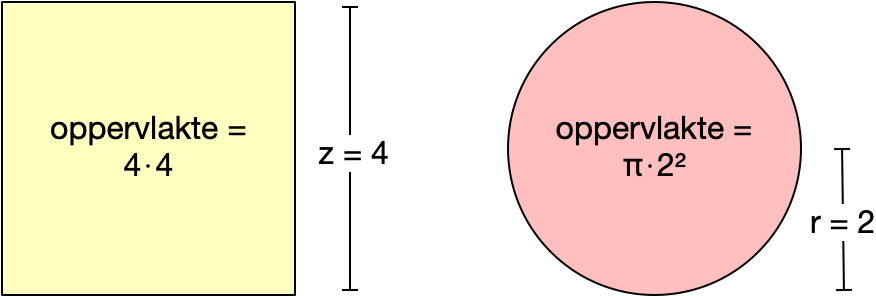

# Figuren

Een traditioneel onderwerp van objectgeorienteerd programmeren is het modelleren van figuren. Je kunt classes maken voor rechthoeken, driehoeken, cirkels en daar instanties van maken. We gaan in deze opdracht een aantal classes ontwerpen en die gebruiken om willekeurige figuren te kunnen sorteren op oppervlakte.

Zoals je wellicht weet worden oppervlaktes op verschillende manieren berekend, afhankelijk van de specifieke figuur. Zo kun je de oppervlaktes van een vierkant en een cirkel berekenen op basis van één maat: de zijde voor een vierkant, en de straal voor een cirkel. Je hebt alleen de juiste formules nodig.

{: style="width:30rem;"}

Voor andere oppervlaktes zijn soms meerdere maten nodig.

## Sorteren

Sorteren in Python gaat meestal via de standaardfunctie `sorted()`. Je kunt deze een lijst meegeven en de functie geeft dan een totaal nieuwe lijst terug met daarin dezelfde elementen, maar dan gesorteerd:

    >>> sorted([4, 2, 3, 1])
    [1, 2, 3, 4]
    >>> sorted(['z', 'a', 'b'])
    ['a', 'b', 'z']

Dit sorteren werkt niet zomaar vanzelf. Het werkt omdat voor integers en strings is bepaald hoe je ze met elkaar kunt *vergelijken*. Het enige dat hiervoor nodig is, is de less-than operator `<`. Deze wordt gebruikt door `sorted()` om de volgorde te bepalen. Ter illustratie zie je hier dat je `<` zo kunt gebruiken:

    >>> 1 < 3
    True
    >>> 'b' < 'a'
    False

Hoe je deze operator zelf definieert volgt in een latere stap.

## Voorbereiding

Bestudeer goed de uitleg in het boek over inheritance vanaf pagina 290. Je moet onderstaande kunnen maken met hulp van deze uitleg, je eerdere kennis van Python en de informatie uit deze opdracht.

## Classes

Werk de classes voor `Square`, `Rectangle` en `Circle` uit in een bestand genaamd `shapes.py`.

*   Elke class moet een `__init__` krijgen waarin de juiste parameters kunnen worden doorgegeven (denk dus aan de straal). En elke class moet een method `area()` definiëren die de juiste oppervlakte berekent en teruggeeft.

*   Er moet daarnaast een class `Shape` zijn waarvan alle figuur-classes afgeleid zijn (met inheritance). Deze class bevat nog geen methods en heeft ook geen `__init__()` nodig. Geef aan dat de andere classes hiervan zijn afgeleid.

Je hebt nu vier classes en je kunt al testen door een instantie te maken en de oppervlakte op te vragen. Je kunt ook al doctests maken voor `area()`, zoals voorgedaan in het boek op pagina 292.

## Sorteren

Om objecten van een class te kunnen sorteren, moet voor deze class de methode `__lt__()` geïmplementeerd worden. Dit is de functie die hoort bij de less-than operator `<`. De methode moet op basis van de beschikbare informatie bepalen of het object `self` kleiner is dan het object `other`:

    def __lt__(self, other):
        ...

Zodra je deze methode hebt geïmplementeerd voor `Shape` is deze ook beschikbaar voor de afgeleide shape-classes. Je kunt dan bijvoorbeeld testen of `Square(2) < Square(1)`.

## Testcode

Maak een hoofdprogramma waarin je diverse `Shape`-objecten instantieert. Stop elk van deze objecten in een lijst. Print daarna de uitkomst van het aanroepen van de standaard Python-functie `sorted()` op deze lijst.

## Andere vergelijkingen

Zoals aangegeven bij de [officiële documentatie](https://docs.python.org/3/library/functions.html#sorted) van `sorted()` is het aan te bevelen om ook de andere "rich comparison" operators te definiëren. Dat zijn de volgende:

    object.__lt__(self, other)  #-> less than
    object.__le__(self, other)  #-> less than or equal to
    object.__eq__(self, other)  #-> equal to
    object.__ne__(self, other)  #-> not equal to
    object.__gt__(self, other)  #-> greater than
    object.__ge__(self, other)  #-> greater than or equal to

Implementeer al deze operators voor de class `Shape`.

Extra uitdaging: je hebt de operator less-than `__lt__` al gedefinieerd. Gebruik je kennis van logica om deze operators te definiëren in termen van die operator. Bijvoorbeeld: less-than-or-equal is gelijk aan `self.__lt__(other) or not other.__lt__(self)`.

## Posities

Voeg voor de `Shape` class ook het idee van *posities* toe. Elke shape krijgt (x,y)-coördinaten die staat voor het centrum van de figuur.

*   Geef `Shape` een `__init__()` voor deze coördinaat en sla ze op als intance-variabelen.

*   Definieer een methode `distance_to(self, other)` voor `Shape` die de afstand tussen twee figuren berekent met hulp van de stelling van Pythagoras:

        math.sqrt((x1-x2)**2 + (y1-y2)**2)

    Waarbij x1, x2, y2 en y2 zijn de respectievelijke coördinaten van de twee shapes waartussen de afstand berekend wordt. Vergeet niet om `math` te importeren!

*   Pas de `__init__()` van de verschillende soorten shapes aan zodat deze ook de (x,y)-coördinaten accepteren en roep de `super().__init__()` aan zoals in de voorbeelden in het boek.

## Afronding

Om het programma compleet te maken voeg je overal de juiste type hints toe en controleer je of je bij alle functies en methods voldoende doctests hebt geschreven.
