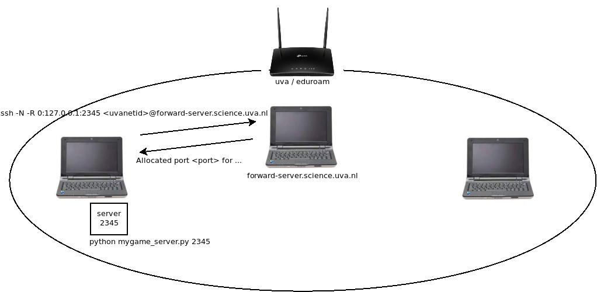

# Meerdere Computers

We willen een multi-player spel gezamelijk op meerdere computers
kunnen spelen.

## Thuis Netwerk

In een netwerk thuis is dat relatief eenvoudig. Op de computer waar de
server gaat runnen moeten we wel eerst uitvinden wat het `Local IP`
address is, zie hiervoor de youtube video van jouw operating system:

- [Linux](https://youtu.be/gaIYP4TZfHI)
- [Mac](https://youtu.be/Ak5zlPENi1s)
- [Windows](https://youtu.be/U181eofiomU)

Stel dat we vinden dat '192.168.0.14' het `Local IP` address van je
computer is.

Daarna starten we de daar de server bv met port '2345', en starten we
de clients op verschillende computers in dit netwerk met port '2345'
en met als host het IP address bv '192.168.0.14'


## UvA / Eduroam Netwerk

Binnen het 'uva' en 'eduroam' netwerk ligt dit iets
ingewikkelder. Om security-redenen mogen computers in dit netwerk
namelijk niet direct verbindingen met elkaar maken, maar we kunnen
speciaal voor dit vak wel computer 'forward-server.science.uva.nl'
gebruiken om toch te verbinden (met dank aan FEIOG).

Start eerst de server op je computer met bv port '2345'.

```
$ python mygame_server.py 2345
```

Open op die computer dan een nieuwe terminal en run daar:

```
$ ssh -N -R 0:127.0.0.1:2345 <uvanetid>@forward-server.science.uva.nl
```

waar '\<uvanetid\>' je studentnummer is. Type je password en daarna zie
je als antwoord bv:

```
Allocated port 39785 for remote forward to 127.0.0.1:2345
```


Dat betekent dat nu iedereen in het netwerk kan verbinden met
`forward-server.science.uva.nl` en port `39785` en dan wordt
doorgestuurd (ge-forward) naar jouw computer op poort `2345` zolang de
'ssh' verbinding in stand blijft. Dus nu kunnen we op computers in dit
netwerk clients laten verbinden met jouw server op poort `2345` met:

```
$ python mygame_client.py <name> 39785 forward-server.science.uva.nl
```


## SSH voor Windows

Als je problemen hebt om in Windows 'ssh' te runnen, run het commando
dan in een 'PowerShell' of 'Command Prompt' door op "powershell" of
"cmd" te zoeken in de search box in of rond het Windows 'Start Menu'.
